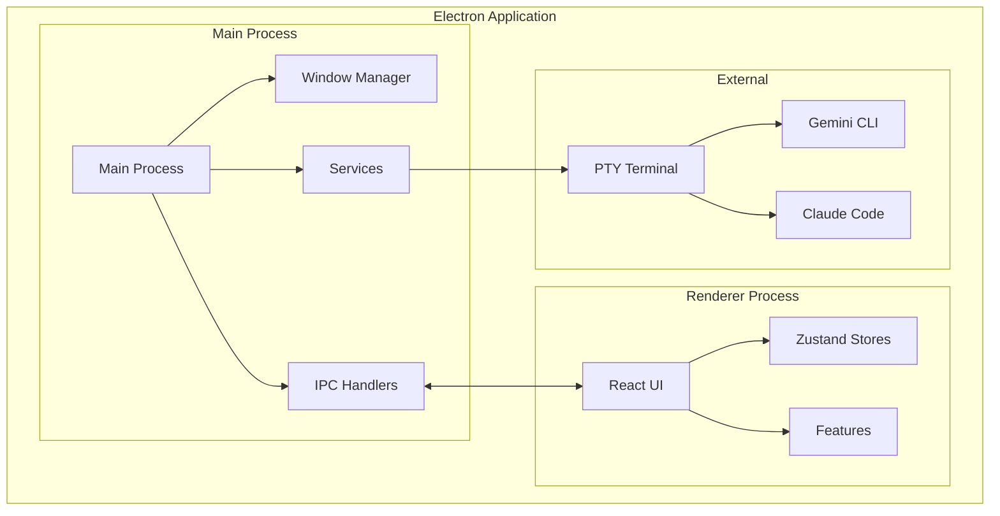
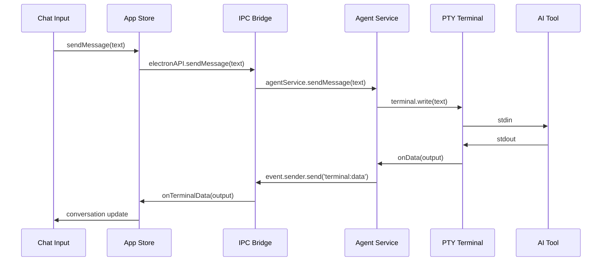
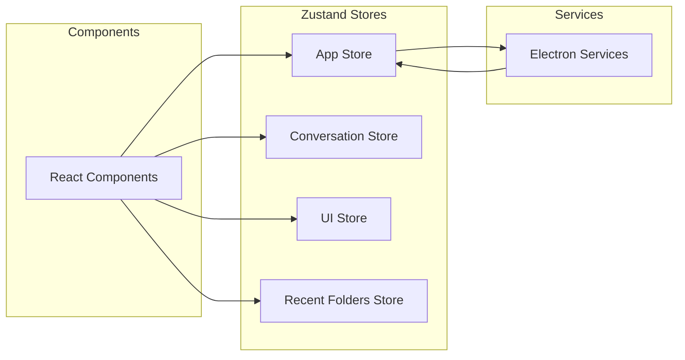
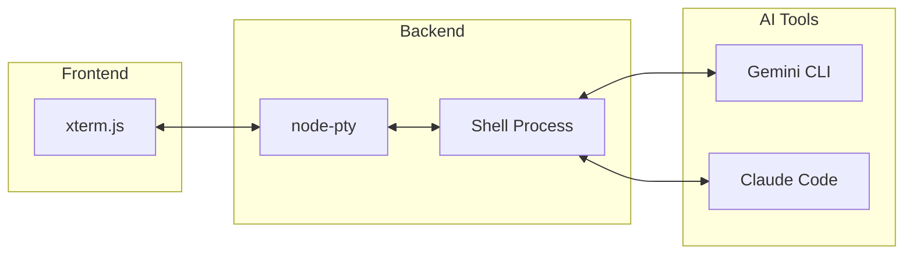

# 아키텍처 개요

EasyCLIAgent는 Feature-Sliced Design 아키텍처를 기반으로 한 Electron 애플리케이션입니다. 이 문서는 시스템의 전체적인 구조와 설계 원칙을 설명합니다.

## 시스템 아키텍처

### 고수준 아키텍처



### 프로세스 분리

#### Main Process (src-electron/)
- **역할**: 시스템 리소스 접근, 창 관리, 보안 제어
- **주요 컴포넌트**:
  - Window Manager: 창 생성 및 관리
  - IPC Handlers: 렌더러와의 통신
  - Services: 비즈니스 로직

#### Renderer Process (src/)
- **역할**: UI 렌더링, 사용자 상호작용
- **주요 컴포넌트**:
  - React Components: UI 컴포넌트
  - Zustand Stores: 상태 관리
  - Features: 기능별 모듈

## Feature-Sliced Design (FSD)

### 계층 구조

```
src/
├── app/              # 앱 초기화 및 프로바이더
├── pages/            # 라우트 및 페이지
├── widgets/          # 독립적인 UI 블록
├── features/         # 비즈니스 기능
├── entities/         # 비즈니스 엔티티
├── shared/           # 공유 리소스
└── stores/           # 상태 관리
```

### Features 구조

각 feature는 독립적인 모듈로 구성됩니다:

```
features/chat-input/
├── index.ts          # Public API
├── model/            # 데이터 모델 및 타입
├── lib/              # 비즈니스 로직 및 훅
└── ui/               # UI 컴포넌트
```

#### 주요 Features

1. **chat-input**: 채팅 입력 기능
   - 자동완성
   - 입력 히스토리
   - 키보드 이벤트 처리

2. **conversation-panel**: 대화 관리
   - 대화 기록 표시
   - 항목 확장/축소
   - 실시간 업데이트

3. **terminal**: 터미널 인터페이스
   - xterm.js 통합
   - PTY 연결
   - 터미널 설정

4. **instruction-editor**: 설정 에디터
   - AI 도구별 설정 파일 편집
   - 실시간 저장
   - Undo/Redo 기능

## 데이터 플로우

### 메시지 전송 플로우



### 상태 관리 플로우



## 서비스 아키텍처

### Agent Service 계층

```typescript
// 계층별 책임 분리
class AgentService {
  private cliChecker: CliChecker;      // CLI 도구 관리
  private terminalManager: TerminalManager; // 터미널 관리
}

class CliChecker {
  // CLI 도구 설치 확인 및 설치
}

class TerminalManager {
  // PTY 터미널 관리
}
```

### IPC Handler 분리

```typescript
// 도메인별 핸들러 분리
setupDirectoryHandlers();    // 디렉토리 관련
setupAgentHandlers();        // AI 도구 관련
setupFileSystemHandlers();   // 파일 시스템 관련
setupAppHandlers();          # 앱 설정 관련
```

## 보안 아키텍처

### Context Isolation

```typescript
// preload.ts - 안전한 API 노출
const electronAPI = {
  selectDirectory: () => ipcRenderer.invoke('select-directory'),
  sendMessage: (message: string) => ipcRenderer.invoke('send-message'),
  // ... 필요한 API만 선택적 노출
};

contextBridge.exposeInMainWorld('electronAPI', electronAPI);
```

### CSP (Content Security Policy)

```typescript
// main.ts - 보안 정책 설정
const cspPolicy = isDev 
  ? "default-src 'self'; script-src 'self' 'unsafe-inline' 'unsafe-eval';"
  : "default-src 'self'; script-src 'self';";
```

## 터미널 아키텍처

### PTY Integration



### 터미널 이벤트 처리

```typescript
// 양방향 데이터 스트림
terminalProcess.onData((data: string) => {
  // 터미널 출력을 UI로 전달
  mainWindow.webContents.send('terminal:data', data);
});

terminalProcess.write(userInput); // 사용자 입력을 터미널로 전달
```

## 상태 영속성

### Zustand Persist

```typescript
// 상태 자동 저장
const useAppStore = create<AppState>()(
  persist(
    (set, get) => ({
      // state and actions
    }),
    {
      name: 'app-store',
      storage: createJSONStorage(() => localStorage),
    }
  )
);
```

### 데이터 분리

- **영구 저장**: 앱 설정, 최근 폴더, UI 설정
- **세션 저장**: 현재 대화, 임시 상태
- **제외**: 민감한 정보 (API 키 등)

## 확장성 설계

### 플러그인 아키텍처 준비

```typescript
// 미래 확장을 위한 인터페이스
interface AIToolPlugin {
  name: string;
  initialize(workspaceDir: string): Promise<boolean>;
  sendMessage(message: string): boolean;
  cleanup(): void;
}
```

### Feature 확장

```typescript
// 새로운 feature 추가 시
features/new-feature/
├── index.ts          # 공개 API
├── model/           # 타입 정의
├── lib/             # 비즈니스 로직
└── ui/              # UI 컴포넌트
```

## 성능 최적화

### 컴포넌트 최적화

- **React.memo**: 불필요한 리렌더링 방지
- **useMemo/useCallback**: 계산 비용 최적화
- **가상화**: 대량 데이터 처리

### 번들 최적화

- **코드 분할**: Route-based splitting
- **Tree Shaking**: 사용하지 않는 코드 제거
- **압축**: Gzip/Brotli 압축

## 모니터링 및 로깅

### 로그 시스템

```typescript
// 계층별 로깅
console.log('[Main]', message);      // 메인 프로세스
console.log('[Renderer]', message);  // 렌더러 프로세스
console.log('[Terminal]', message);  // 터미널 관련
console.log('[IPC]', message);       // IPC 통신
```

### 에러 추적

```typescript
// 전역 에러 핸들링
process.on('uncaughtException', (error) => {
  console.error('Uncaught Exception:', error);
});

window.addEventListener('unhandledrejection', (event) => {
  console.error('Unhandled Promise Rejection:', event.reason);
});
```

## 테스트 아키텍처

### 테스트 계층

1. **Unit Tests**: 개별 함수/컴포넌트
2. **Integration Tests**: Feature 간 통합
3. **E2E Tests**: 전체 워크플로우

### Mock 전략

```typescript
// IPC Mocking
const mockElectronAPI = {
  selectDirectory: jest.fn(),
  sendMessage: jest.fn(),
};

Object.defineProperty(window, 'electronAPI', {
  value: mockElectronAPI,
});
```

이 아키텍처는 확장성, 유지보수성, 성능을 모두 고려하여 설계되었으며, 각 계층이 명확한 책임을 가지고 독립적으로 발전할 수 있도록 구성되어 있습니다.